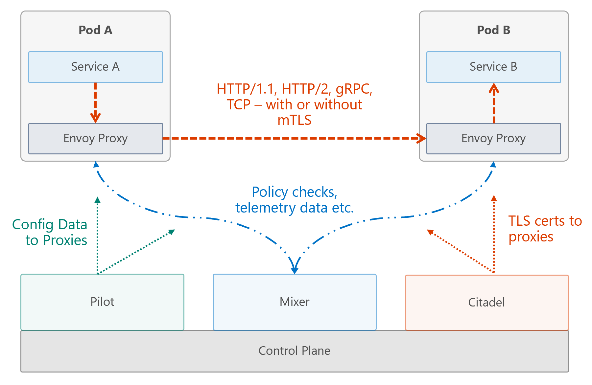

# Service Mesh with Istio #

In this challenge you will install a service mesh in your Azure AKS cluster and implement most of the features Istio provides.

> Why would you want such a mesh? There are many reasons, but most important is the fact that you can add - among others - some complicated routing, loadbalancing, fault injection etc. scenarios that you couldn't achieve otherwise or with a huge effort.

Istio adds:

- Monitoring
- Tracing
- Circuit Breakers
- Request Routing
- Load Balancing (Round Robin, Least Connected, Random etc.)
- Fault Injection (Delays / Aborts)
- Retries / Timeouts
- Request Mirroring
- Access Control / Authorization
- Rate Limiting
- ...and much more!

**Although Istio has reached version 1.0** and is now marked "production ready", beware of the fact that not each of all of these features are in that stage: <https://istio.io/about/feature-stages/>

## Prerequisites ##

Istio version >= 1.0.0 and Kubernetes >= 1.10.6.

## Here's what you'll learn ##

1. [How to install Istio in your AKS cluster](challenges.2.1.sm-installation.md)
1. [How to configure ingress routes and request routing](challenges.2.2.sm-ingress-rr.md)
1. [How to remove slow/buggy containers temporarily and implement retry strategies](challenges.2.3.sm-remove-retry.md)
1. [How to implement the Circuit Breaker pattern](challenges.2.4.sm-circuitbreaker.md)
1. [How to gain insights about your applications routes](challenges.2.5.sm-insights.md)
1. [How to play with fault injection to challenge your services](challenges.2.6.sm-faultinjection.md)
1. [How to test new service versions with request mirroring](challenges.2.7.sm-requestmirroring.md)
1. [How to implement the Canary Deployment pattern with Istio](challenges.2.8.sm-canary.md)
1. [How to handle external service calls / Egress](challenges.2.9.sm-egress.md)
1. [Istio Under the Hood](challenges.2.10.sm-deepdive.md)

## How Istio works ##

This can only be a quick introduction, but in general, Istio consists of a control and a dataplane. The dataplane is basically where your data flows, whereas the controlplane accepts your input in order to configure the dataplane. Usually, a pod consists of one container if no special requirements are demanded, but for Istio there will be a sidecar container running in parallel to the actual application container. This sidecar, which is an [envoy proxy](https://www.envoyproxy.io/) is responsible for handling all the network related stuff for the pod. Istio is able to inject the sidecar automatically while you deploy your pods to Kubernetes.

More details can be found [here](https://istio.io/docs/concepts/what-is-istio/overview/).

## The Cost of Using Istio ##

Using Istio is not expansive. It's written in Go an adds little overhead to your architecture / application. The performance you **may** lose should be paid for by the increase of developer productivity and the fact that applications will run more robust inside the cluster, when you implement features like fault injection / retries / circuit breakers etc.

And don't forget the fact, that it'll make you sleep better at night :wink: