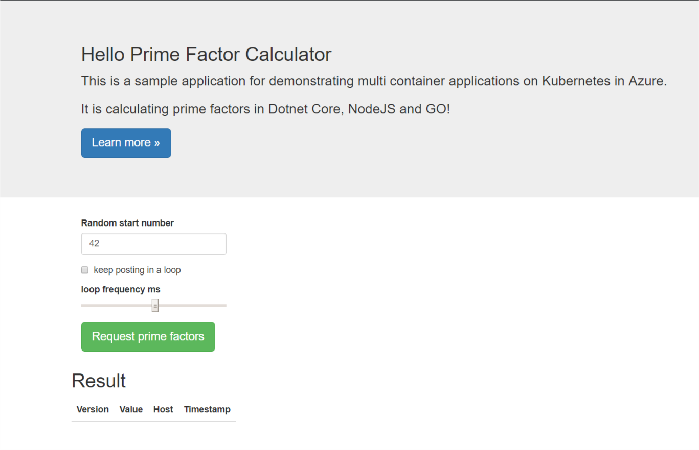
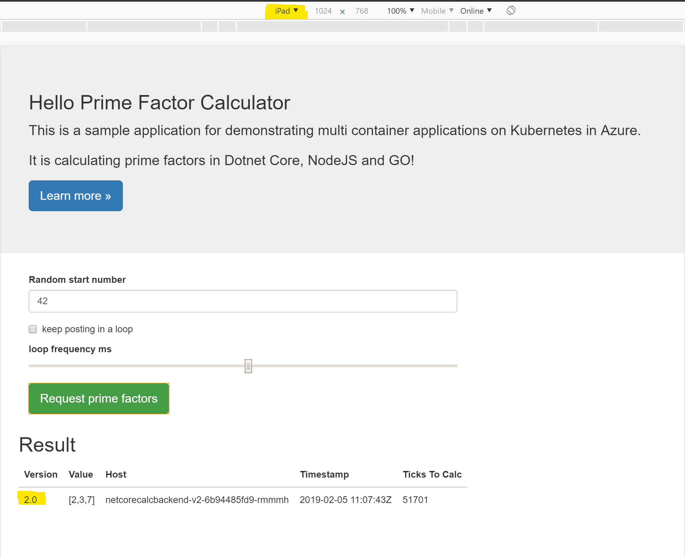

# Configure Ingress Routes and Request Routing #

> Need help? All neccessary files are [here :blue_book:](hints/yaml/challenge-2/request-routing)!

## Here is what you will learn ##

- Make the sample application available through the Istio ingress controller
  - create destination rules 
  - enable routing based on service subsets / Kubernetes labels 
  - Weight-based routing
  - Routing based on header values

## Install Destionation Rules ##

### What is it for? ###

> A **destination** indicates the network addressable service to which the request/connection will be sent. A **DestinationRule** defines policies that apply to traffic intended for a service after routing has occurred. (*Source: Istio Documentation*)

...and...

> Subsets can be used for scenarios like A/B testing, or routing to a specific version of a service. (*Source: Istio Documentation*)

So, to be able to communicate with our service via the service mesh, we need to create the corresponding desination rules.

Let's create one for the frontend-service and one for the backend-service:

```yaml
apiVersion: networking.istio.io/v1alpha3
kind: DestinationRule
metadata:
  name: calcfrontend-rule
  namespace: challenge2
spec:
  host: calcfrontendsvc
  subsets:
  - name: v2
    labels:
      version: v2
---
apiVersion: networking.istio.io/v1alpha3
kind: DestinationRule
metadata:
  name: calcbackend-rule
  namespace: challenge2
spec:
  host: calcbackendsvc
  subsets:
  - name: v1
    labels:
      version: v1
```

Check Destination Rules

```shell
$ kubectl get destinationrules -n challenge2

NAME                AGE
calcbackend-rule    1m
calcfrontend-rule   1m
```

## Install Gateway and Virtual Services ##

### What is it for? ###

> A **Gateway** describes a load balancer operating at the edge of the mesh receiving incoming or outgoing HTTP/TCP connections. The specification describes a set of ports that should be exposed, the type of protocol to use, SNI configuration for the load balancer, etc.

> A **VirtualService** defines a set of traffic routing rules to apply when a host is addressed. Each routing rule defines matching criteria for traffic of a specific protocol. If the traffic is matched, then it is sent to a named destination service (or subset/version of it) defined in the registry. The source of traffic can also be matched in a routing rule. This allows routing to be customized for specific client contexts.

```yaml
apiVersion: networking.istio.io/v1alpha3
kind: Gateway
metadata:
  name: frontend-gateway
  namespace: challenge2 
spec:
  selector:
    istio: ingressgateway
  servers:
  - port:
      number: 80
      name: http
      protocol: HTTP
    hosts:
    - "*"
---
apiVersion: networking.istio.io/v1alpha3
kind: VirtualService
metadata:
  name: app-vs
  namespace: challenge2  
spec:
  hosts:
  - "*"
  gateways:
  - frontend-gateway
  http:
  - match:
    - uri:
        exact: /api/calculation
    - uri:
        prefix: /
    route:
    - destination:
        host: calcfrontendsvc
        port:
          number: 80
---
apiVersion: networking.istio.io/v1alpha3
kind: VirtualService
metadata:
  name: frontend-vs
  namespace: challenge2
spec:
  hosts:
  - calcfrontendsvc
  http:
    - route:
      - destination:
          host: calcfrontendsvc
          subset: v2
---
apiVersion: networking.istio.io/v1alpha3
kind: VirtualService
metadata:
  name: backend-vs
  namespace: challenge2
spec:
  hosts:
  - calcbackendsvc
  http:
    - route:
      - destination:
          host: calcbackendsvc
          subset: v1
```

Check Routing Rules and Gateway Installation

```shell
$ kubectl apply -f .\c2-ingress-rr.yaml

gateway.networking.istio.io "frontend-gateway" created
virtualservice.networking.istio.io "app-vs" created
virtualservice.networking.istio.io "frontend-vs" created
virtualservice.networking.istio.io "backend-vs" created
```

```shell
$ kubectl get virtualservices -n challenge2

NAME          AGE
app-vs        14s
backend-vs    13s
frontend-vs   14s

$ kubectl get gateways -n challenge2

NAME               AGE
frontend-gateway   1m

$ kubectl describe svc/istio-ingressgateway -n istio-system
```
Copy the Load Balancer IP of the Ingress Gateway an open the browser: http://<INGRESS_GATEWAY_IP>/

You should see something like this:



## Weigth-based Routing ##

There may be situations when running services in Kubernetes where you want to regulate the amount of traffic coming to (a set of) pods, e.g. when you deploy a new version of a service. 

With Istio, you are able to define weight-based routing rules.

Let's try to simulate that...deploy version 2 of the .NETCore calc-backend service (see: `labels` has now `version: v2`).

```yaml
apiVersion: extensions/v1beta1
kind: Deployment
metadata:
  name: netcorecalcbackend-v2
  namespace: challenge2
spec:
  replicas: 1
  minReadySeconds: 5
  strategy:
    type: RollingUpdate
    rollingUpdate:
      maxSurge: 1
      maxUnavailable: 1
  template:
    metadata:
      labels:
        name: netcorecalcbackend
        app: backend
        version: v2
    spec:
      containers:
      - name: netcorecalcbackend
        image: csaocpger/netcorecalcbackend:2.0
        ports:
          - containerPort: 80
            name: http
            protocol: TCP
        env: 
          - name: "PORT"
            value: "80"
```

Make `version v2` available as a known subset:

```yaml
apiVersion: networking.istio.io/v1alpha3
kind: DestinationRule
metadata:
  name: calcbackend-rule
  namespace: challenge2
spec:
  host: calcbackendsvc
  subsets:
  - name: v1
    labels:
      version: v1
  - name: v2
    labels:
      version: v2
```

Now, apply the weight-based routing where we refernce version v2 via the created subset.

```yaml
apiVersion: networking.istio.io/v1alpha3
kind: VirtualService
metadata:
  name: backend-vs
  namespace: challenge2
spec:
  hosts:
  - calcbackendsvc
  http:
    - route:
      - destination:
          host: calcbackendsvc
          subset: v1
        weight: 50
      - destination:
          host: calcbackendsvc
          subset: v2
        weight: 50
```

Check --> 50% from v2

## Header-based Routing ##

Sometimes, it may be neccessary that you can route based on header values...perhaps you want to enable access to pre-release features or want to serve requests made from mobile devices by other services. You can achieve this by using the `match` field in the http routing definition.

As an example, we define routes that will be exclusively used when made from a mobile device.

Apply the following YAML definition:

```yaml
apiVersion: networking.istio.io/v1alpha3
kind: VirtualService
metadata:
  name: backend-vs
  namespace: challenge2
spec:
  hosts:
  - calcbackendsvc
  http:
  - match:
    - headers:
        user-agent:
          regex: .*Mobile.*
    route:
      - destination:
          host: calcbackendsvc
          subset: v2
  - route:
    - destination:
        host: calcbackendsvc
        subset: v1
```

Open the website on your mobile phone or simply simulate a mobile device with the developer tools of your browser. You should be exclusively routed to version v2 of the service.



