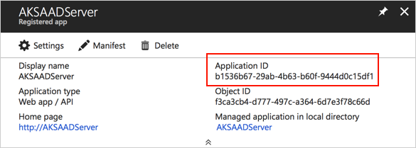
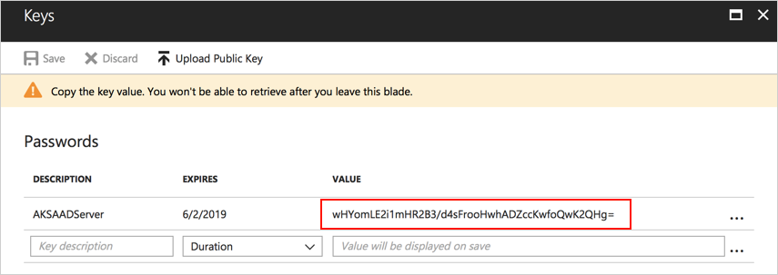
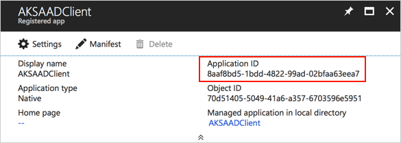
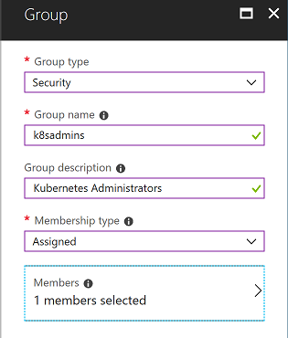
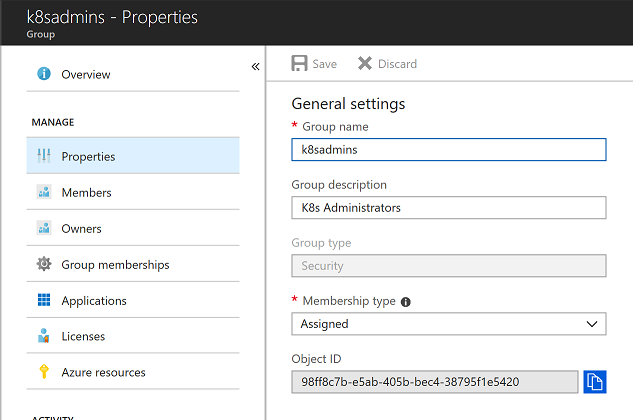

# Create a cluster with Azure Active Directory integration #

## Here's what you'll learn ##

- Azure Active Directory
  - create an AAD application for the API server and kubectl client
  - create an AAD group that will have the users allowed to login to the cluster
- Kubernetes
  - create a cluster with RBAC and AAD integration
  - bind cluster roles to AAD groups
  - get admin credentials for the cluster
  - login with an AAD user


*AAD Login Flow*

## Create AAD applications for the Kubernetes cluster and the client ##

> ***Optional:*** If you don't want to use your organization's AAD, create a new tenant for testing purposes and afterwards switch to that directory: <https://docs.microsoft.com/en-us/azure/active-directory/develop/quickstart-create-new-tenant#create-a-new-azure-ad-tenant>

- Go to your directory and open the *Properties* blade. Note down the ***Directory ID***. We will refer to that value as *TENANT_ID* during the deployment of the cluster.

- Create a new server application that represents the Kubernetes API server: <https://docs.microsoft.com/en-us/azure/aks/aad-integration#create-server-application>
  - Note down the application id (referred to as *APP_ID* later) and application key (referred to as *APP_KEY* later)
  
   

   

- Create a new client application that represents the Kubernetes CLI (kubectl): <https://docs.microsoft.com/en-us/azure/aks/aad-integration#create-client-application>
  - Note down application id (referred to as *CLIENT_ID* later)

   
   
- Go to the ***Groups*** blade in the Azure Portal (Azure Active Directory), create a new group named *k8sadmins* and assign your user to it.

   

- After the group is created, open the properties blade and note down the ***Object ID*** (referred to as *GROUP_ID* later)

   

## Create your AKS cluster with AAD integration ##

Open a shell and create an AKS cluster via Azure CLI.

```Shell
> az aks create --resource-group YOUR_RESOURCE_GROUP --name YOUR_CLUSTER_NAME --generate-ssh-keys \
  --aad-server-app-id APP_ID \
  --aad-server-app-secret APP_KEY \
  --aad-client-app-id CLIENT_ID \
  --aad-tenant-id TENANT_ID
```

> This will take a few minutes to complete

After the cluster has been created, download the admin credentials to initially assign cluster roles to the AAD group.

```Shell
> az aks get-credentials --resource-group YOUR_RESOURCE_GROUP --name YOUR_CLUSTER_NAME --admin
```

Now assign the cluster role ***cluster-admin*** to the AAD group. Therfore, create a file *clusterrolebinding.yaml* with the following content (replace *GROUP_ID* with the value of your AAD group id) and deploy it to your AKS cluster:

```YAML
apiVersion: rbac.authorization.k8s.io/v1
kind: ClusterRoleBinding
metadata:
 name: my-cluster-admins
roleRef:
 apiGroup: rbac.authorization.k8s.io
 kind: ClusterRole
 name: cluster-admin
subjects:
- apiGroup: rbac.authorization.k8s.io
  kind: Group
  name: "GROUP_ID"
```

```Shell
> kubectl apply -f clusterrolebinding.yaml
```

## Log in with your AAD User ##

Now that everything is setup and ready in your AKS cluster, download the context for non-admin users and execute a *kubectl* command to trigger the device login flow of your Azure Active Directory tenant.

```Shell
> az aks get-credentials --resource-group YOUR_RESOURCE_GROUP --name YOUR_CLUSTER_NAME
```

> Info: --admin is omitted!

```Shell
> kubectl get nodes

To sign in, use a web browser to open the page https://microsoft.com/devicelogin and enter the code THZASDERL to authenticate.
```
After signing in, you should be able to query nodes:

```Shell
aks-nodepool1-14322398-0   Ready     agent     2h        v1.10.6
aks-nodepool1-14322398-1   Ready     agent     2h        v1.10.6
aks-nodepool1-14322398-2   Ready     agent     2h        v1.10.6
```

## Challenge: Create a ClusterRole/Group to be able to only read pods ##

First, create a group in the Azure Active Directory connected to your cluster (note down the **object-id**!).

Now create a new AAD user and assign the user to the group.

To be able to use the group in the Kubernetes cluster, create a **cluster-role** named `custom:pod-reader` and a corresponding **cluster-role-binding** assigning the AAD group as "subject".

> Remember to use the "admin context"

Now log in with the new user (if it's not working, delete the context and/or user in ~/.kube/config you used before to access the cluster via RBAC).
- try to read the cluster nodes via `kubectl get nodes`
- try to read the pods running in the cluster via `kubectl get pods`

> Need help? Check deployment files [here :blue_book:](hints/yaml/challenge-1)!

# Housekeeping #

If you created an AAD tenant for testing purposes and don't need it anymore **after the workshop**, delete the directory via the Azure Portal under ***Azure Active Directory > Overview*** ("Delete directory" button).
In case you get any errors due to enterprise applications that cannot be delete, here's help: <https://blogs.msdn.microsoft.com/kennethteo/2017/09/19/deleting-azure-ad-tenant/>
