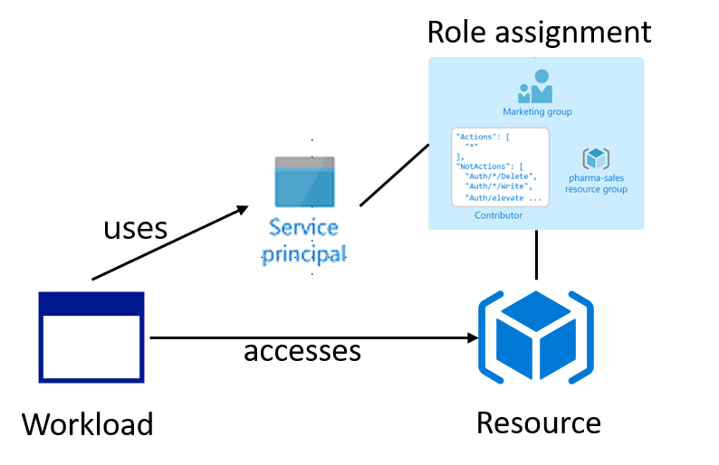
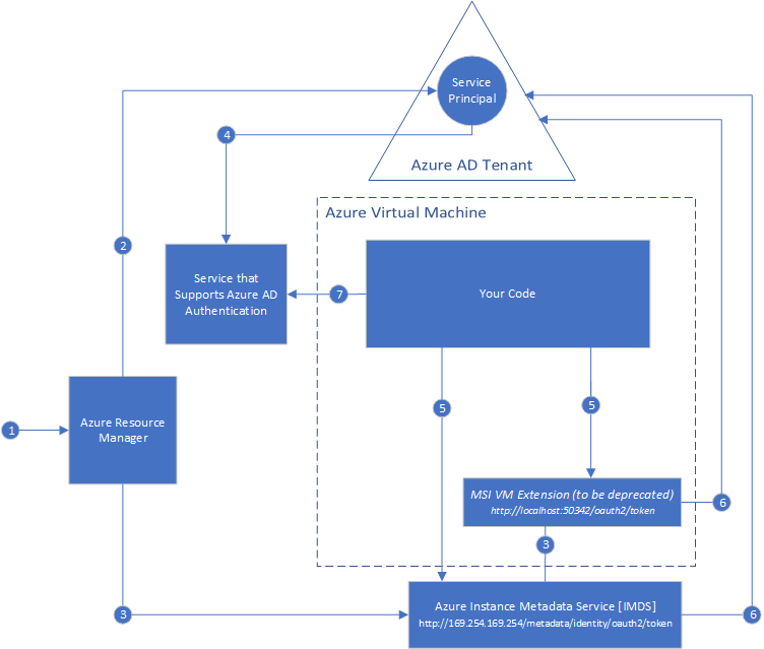
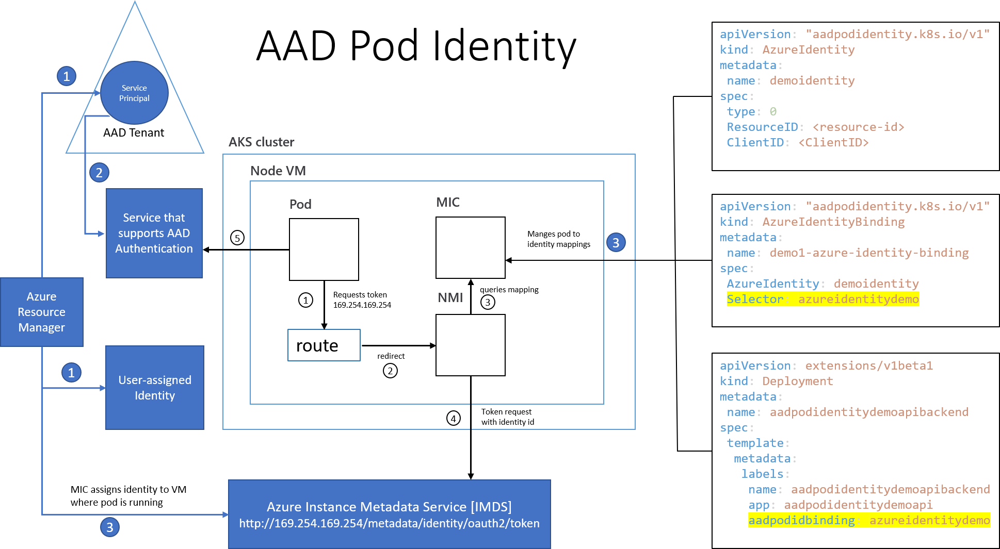

# Create a Kubernetes pod that uses Managed Service Identity (MSI) to access an Azure Key Vault

## Here is what you learn ##

- Create a [user-assigned managed identity](https://docs.microsoft.com/en-us/azure/active-directory/managed-identities-azure-resources/overview) 
- Install [aad-pod-identity](https://github.com/Azure/aad-pod-identity) in your cluster
- Create an Azure Key Vault and store credentials
- Deploy a pod that uses a user-assigned managed identity to access an Azure Key Vault

## Access Azure resources in your workload

To access Azure resources in your workload, your workload must be authorized using a Service Principal. 



Using a Service Principal means, that as a developer you have to store client id and client secret in your application settings. You are responsible for ensuring that this information does not fall into the wrong hands.
In addition you have to do a rolling update for the key credential when it expires.

With Azure [MSI (Managed Service Identity)](https://docs.microsoft.com/en-us/azure/active-directory/managed-identities-azure-resources/overview
) you can assign an AAD identity to your workload that can be used to authorize access to Azure resources. Your workload can acquire an AAD token before acessing Azure resources. The created Service Principal is fully managed by Azure.



With [AAD Pod Identity](https://github.com/Azure/aad-pod-identity) you can assign an AAD identity to your pod.



## Deploy the  aad-pod-identity infra in your existing cluster ##

Open a shell and run the following ```kubectl create``` command:

```Shell
kubectl create -f https://raw.githubusercontent.com/Azure/aad-pod-identity/1.3.0-mic-1.4.0-nmi/deploy/infra/deployment.yaml
```

If you have an RBAC enabled cluster run the following ```kubectl create``` command:

```Shell
kubectl create -f https://raw.githubusercontent.com/Azure/aad-pod-identity/1.3.0-mic-1.4.0-nmi/deploy/infra/deployment-rbac.yaml
```

Now you have NMI and MIC running in your cluster. To get a detailed description of NMI and MIC take a look [here](https://github.com/Azure/aad-pod-identity#design)

## Create an Azure user-assigned managed identity ##

Remember the client id, principal id and resource id for the identity.

```Shell
az identity create -g <resource-groupname> -n <managedidentity-resourcename>
```

Now you have created a managed identity with the name ```managedidentity-name```. Take a look at your resource group. The identity is listed as an Azure resource.

## Assign Reader Role to the new created identity ## 

Using the principal id from the last step, assign the reader role to the new created identity for the resource group.

```
az role assignment create --role Reader --assignee <principal-id> --scope /subscriptions/<subscriptionid>/resourcegroups/<resourcegroup>
```

## Get your AKS Service Principal object id ##

If you don't know the Service Principal that is used for your Cluster do the following:

```
az aks show -n <akscluster-name> -g <resource-groupname>
```

Rember the client id from the output under the section:

```JSON
 "servicePrincipalProfile": {
    "clientId": "<client id>"
  },
```

After that run the following command to get details of the Service Principal

```
az ad sp show --id <client id>
```

Remember the object id from the output.

```JSON
"objectId": "<object id>"
```

## Create permissions for MIC ##

MIC uses the service principal credentials stored within the the AKS cluster to access azure resources. This service principal needs to have Microsoft.ManagedIdentity/userAssignedIdentities/*/assign/action permission on the identity for usage with User assigned MSI.

Assign the required permission and use the object id from the previous step as sp id.

```Shell
az role assignment create --role "Managed Identity Operator" --assignee <sp id> --scope <full id of the managed identity>
```

## Create an Azure KeyVault

To demo AAD pod identity we create an Azure KeyVault and grant read access for the created user-assigned identity.

Create an Azure KeyVault in your resource group and remember the id from the output.

```Shell
>az keyvault create -n <global unique name> -g <resource group> --sku standard
```

Set access ploicies for your user-assigned identity using the principal id from the step above.

```Shell
>az keyvault set-policy -n <keyvault name> --object-id <principal id of your user-assigned identity> --secret-permissions get, list --key-permissions get, list --certificate-permissions get, list
```

Add some secrets to your key vault that we will be used later in the demo application.
Do not change the name of the secrets!

```Shell
>az keyvault secret set --vault-name <key vault name> --name Settings--ValueOne --value DemoValueOne
>az keyvault secret set --vault-name <key vault name> --name Settings--ValueTwo --value DemoValueTwo
```

## Install Identity on your AKS Cluster ##

Edit and save the file [aadpodidentity.yaml](hints/yaml/challenge-aadpodidentity/aadpodidentity.yaml).
Replace clientid and manage-didentity-resourcename.

```YAML
apiVersion: "aadpodidentity.k8s.io/v1"
kind: AzureIdentity
metadata:
 name: demoidentity
spec:
 type: 0
 ResourceID: /subscriptions/<subid>/resourcegroups/<resourcegroup>/providers/Microsoft.ManagedIdentity/userAssignedIdentities/<managedidentity-resourcename>
 ClientID: <clientid>
```

```Shell
kubectl create -f aadpodidentity.yaml 
```

## Install Pod to Identity binding ##

Edit and save the file [aadpodidentitybinding.yaml](hints/yaml/challenge-aadpodidentity/aadpodidentitybinding.yaml)

```YAML
apiVersion: "aadpodidentity.k8s.io/v1"
kind: AzureIdentityBinding
metadata:
 name: demo1-azure-identity-binding
spec:
 AzureIdentity: demoidentity
 Selector: azureidentitydemo
```

```Shell
kubectl create -f aadpodidentitybinding.yaml
```

To use the AzureIdentityBinding in your deployment you must use a label named ```aadpodidbinding``` and set its value to the value of the AzureIdentityBinding's Selector value, e.g.:

``` yaml
labels:
  aadpodidbinding: azureidentitydemo
```  

## Install demo application ##

There is already a demo application implemented in ASP.NET Core to demo the usage of AAD Pod Identity. The application is a simple REST API that loads its settings from the above created Azure key vault. You can find the application [here](apps/aspnetcore-aadpodidentity/AadPodIdentityDemoApi).
The application uses the [Options Pattern](https://docs.microsoft.com/en-us/aspnet/core/fundamentals/configuration/options?view=aspnetcore-2.2) to load application settings into a simple object.

```C#
public class SettingsOptions
{
    public string ValueOne { get; set; }
    public string ValueTwo { get; set; }
}
```

The binding from the settings to the SettingsObject is configures in [Startup.cs](apps/aspnetcore-aadpodidentity/AadPodIdentityDemoApi/Startup.cs).

```C#
services.Configure<SettingsOptions>(options => Configuration.Bind("Settings", options));
```

To load settings from an Azure key vault, ASP.NET Core must be configured in [Program.cs](apps/aspnetcore-aadpodidentity/AAdPodIdentityDemoApi/Program.cs)

```C#
public static IWebHostBuilder CreateWebHostBuilder(string[] args) =>
            WebHost.CreateDefaultBuilder(args)
                .UseStartup<Startup>()
                .ConfigureAppConfiguration((ctx, builder) => 
                {
                    var config = builder.Build();
                    var kvurl = config["KeyVault:BaseUrl"];
                    var tokenProvider = new AzureServiceTokenProvider();
                    var kvClient = new KeyVaultClient((authority, resource, scope) => tokenProvider.KeyVaultTokenCallback(authority, resource, scope));
                    builder.AddAzureKeyVault(kvurl, kvClient, new DefaultKeyVaultSecretManager());
                });
```

You can see that a special component named AzureServiceTokenProvider is used. This component is responsible to acquire a token on behalf of your user-assigned identity to access the Azure key vault.

Now its time to build the docker image for the demo application. Open a shell and go to the directory where the [dockerfile](apps/aspnetcore-aadpodidentity/AadPodIdentityDemoApi/dockerfile) is located and run the following command to create the image.

```Shell
docker build -t aadpodidentitydemoapi:1.0 .
```

Now tag your image to push it to your Azure Container Registry

```Shell
docker tag aadpodidentitydemoapi:1.0 <your registryname>.azurecr.io/aadpodidentitydemoapi:1.0
```

Login to your Azure Container Registry instance.

```Shell
az acr login -n <your registry name> -g <resourcegroup name>
```

Push the image to your registry.

```Shell
docker push <your registry name>.azurecr.io/aadpodidentitydemoapi:1.0
```

Deploy the Demo Application.
Open the [deployment yaml-file](hints/yaml/challenge-aadpodidentity/demoapi.yaml) and replace the value of the environment variable ```KeyVault__BaseUrl``` with the url of your key vault and specify the secret to access your Azure container registry.

```yaml
apiVersion: extensions/v1beta1
kind: Deployment
metadata:
  name: aadpodidentitydemoapibackend
spec:
  replicas: 3
  minReadySeconds: 5
  strategy:
    type: RollingUpdate
    rollingUpdate:
      maxSurge: 1
      maxUnavailable: 1
  template:
    metadata:
      labels:
        name: aadpodidentitydemoapibackend
        app: aadpodidentitydemoapi
        aadpodidbinding: azureidentitydemo
    spec:
      containers:
      - name: aadpodidentitydemoapi
        image: anmock.azurecr.io/aadpodidentitydemoapi:1.0
        env:
          - name: KeyVault__BaseUrl
            value: "<your keyvault url e.g.: https://myvault.vault.azure.net>"
        ports:
          - containerPort: 80
            name: http
            protocol: TCP 
      imagePullSecrets:
        - name: <your docker-registry secret>
```

Run the ```kubectl apply``` command.

```Shell
kubectl apply -f .\demoapi.yaml
```

Get the IP address of the demoapi service using kubectl.

```Shell
kubectl get service
```

```Shell
NAME                       TYPE           CLUSTER-IP     EXTERNAL-IP    PORT(S)        AGE
aadpodidentitydemoapisvc   LoadBalancer   10.0.206.148   <public IP>   80:32073/TCP   1d
```

Open a browser and navigate to ```http://<public IP>/swagger``` and try out the GET http request ```/api/settings```. The values stored in your key vault are returned.

```Json
{
  "valueOne": "DemoValueOne",
  "valueTwo": "DemoValueTwo"
}
```