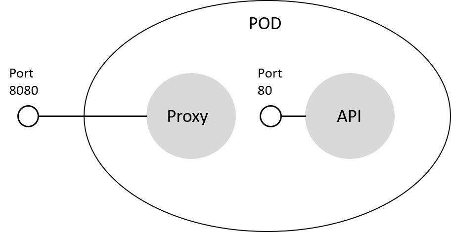

# Create a deployment using Sidecar-Pattern

## Here is what you learn

- Create a deployment with an additional container that acts as proxy for your API.
- Your API is only accessible from the proxy.

To demo the sidecar pattern an [application](src/sidecar/src) is already implemented. The application consists of two components that are implemented using ASP.NET Core.
The first component named SidecarProxy acts, as implied by its name, as proxy and forwards all requests to the second component DemoApi. To do all the forwarding stuff, the SidecarProxy uses [Microsoft.AspNetCore.Proxy](https://github.com/aspnet/Proxy). The SidecarProxy is running on port 8080.
To have a good demo usecase the SidecarProxy injects some additional http headers when the request is forwarded to the DemoApi.
The DemoApi just echos these headers and runs on port 80 that is not accessible outside of the deployment.

The following diagram illustrates the scenario:





## Deploy the Demo Application to your cluster

Open a shell and navigate to the [Demo API project](apps/aspnetcore-sidecar/DemoApi) and build the docker image.

```Shell
docker build -t sidecardemoapi:1.0 .
```

Now tag your image to push it to Azure container registry later.

```
docker tag sidecardemoapi:1.0 <your acr name>.azurecr.io/sidecardemoapi:1.0
```

Navigate to the [SidcarProxy project](apps/aspnetcore-sidecar/SidecarProxy) and build the docker image.

```
docker build -t sidecarproxy:1.0 .
```

Now tag your image to push it to Azure container registry later.

```Shell
docker tag sidecarproxy:1.0 <your acr name>.azurecr.io/sidecarproxy:1.0
```

## Push the images to Azure container registry

Login to your Azure container registry.

```
az acr login -n <your acr name>
```

Now push the docker images.

```
docker push <your acr name>.azurecr.io/sidecardemoapi:1.0
docker push <your acr name>.azurecr.io/sidecarproxy:1.0
```

## Deploy the application

Open the [deployment file](hints/yaml/challenge-sidecar/deployment.yaml) and replace the Azure container registry name and image secret.

```
kubectl apply -f .\deployment.yaml
```

Get the ip address of the sidecar demo service.

```
NAME        TYPE           CLUSTER-IP     EXTERNAL-IP     PORT(S)        AGE
sidecarsvc  LoadBalancer   10.0.47.242    13.95.223.194   80:31007/TCP   5d
```

```Shell
kubectl get service
```

Open your browser and navigate to:

```
http://<service ip>/swagger/
```

Try out the ```Echo``` method, which just echos all received HTTP headers and take a look at the response.
There are two headers which were injected by the sidecar proxy:

```JSON
{
"title": "Injected-Header-One",
"values": "Value-One"
},
{
"title": "Injected-Header-Two",
"values": "Value-Two"
}
```
